# Inventory Management System

Sistema web de gestión de inventario desarrollado con **ASP.NET Core MVC**, enfocado en la práctica de **desarrollo backend**, modelado de datos relacionales y aplicación de buenas prácticas de arquitectura.


---

##  Video Demo Completo

[](https://youtu.be/QWtmuNkuc6g)

**👉 [Ver demo completa en YouTube (1:11 min)](https://youtu.be/QWtmuNkuc6g)**

---

##  Vista Rápida

### Pagina de Index con informacion sobre el proyecto y botones para dirigir al proyecto.
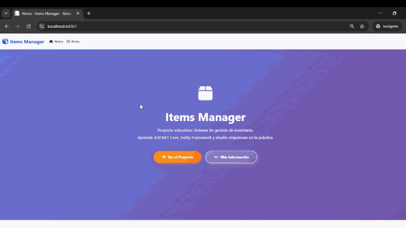

### Edicion de items.
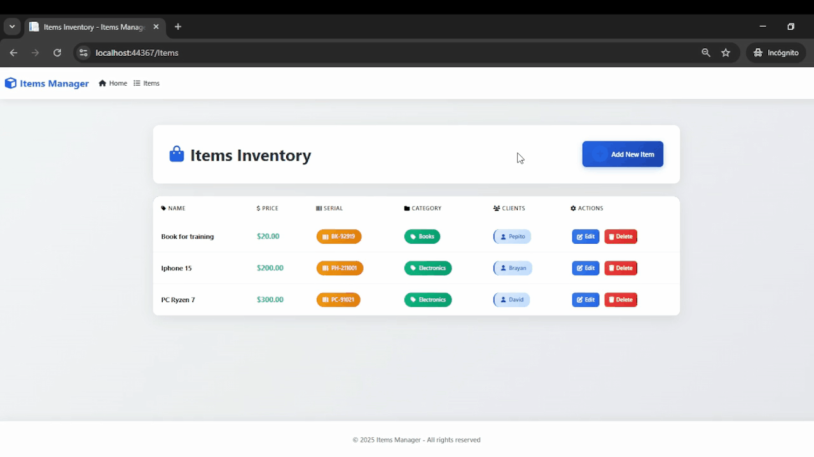

### Elinacion de items.
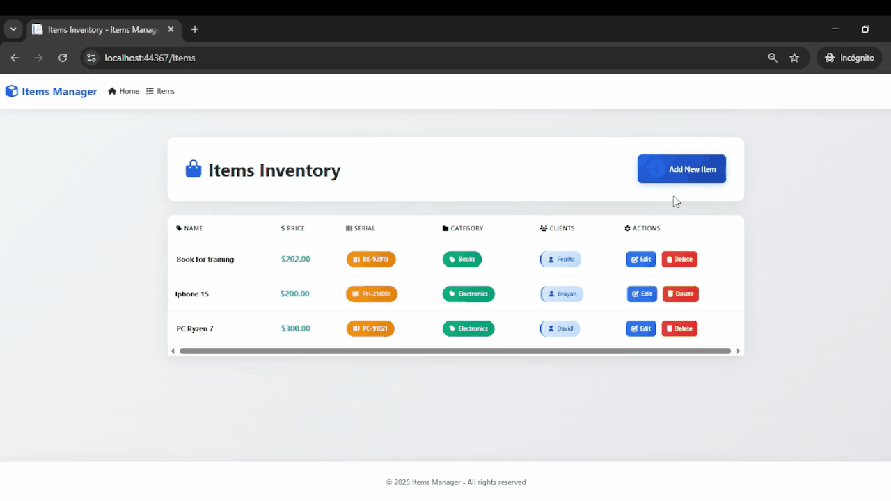

### Creacion de items.
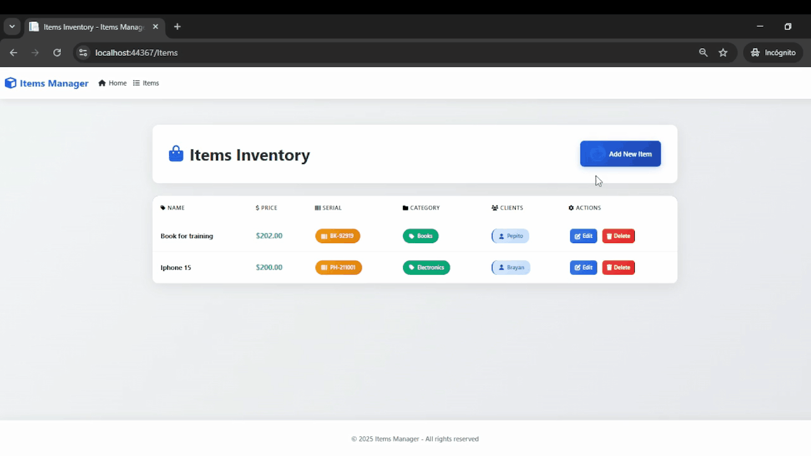

---

##  Características

-  **CRUD completo de Items**
-  Gestión de **Categorías**
-  Asignación de **Serial Numbers**
-  Asociación de **Clientes** a productos
-  Modelado de datos con relaciones:
  - **Uno a Uno (1:1)** → Item ↔ SerialNumber
  - **Uno a Muchos (1:N)** → Category ↔ Items
  - **Muchos a Muchos (N:N)** → Items ↔ Clients
-  Uso de **ViewModels** para separación de responsabilidades
-  Operaciones **asíncronas** (`async / await`)
-  Consultas con **LINQ**, `Include` y `ThenInclude`
-  Interfaz **responsive** con Bootstrap y CSS personalizado
-  Validaciones de datos y protección CSRF
-  Control de versiones con **Git y GitHub**

---

##  Tecnologías Utilizadas

### Backend
- ASP.NET Core MVC
- C#
- Entity Framework Core
- LINQ
- SQL Server

### Frontend
- HTML5 / CSS3
- Bootstrap 5
- Font Awesome

---

##  Instalación

### Prerrequisitos
- [.NET 7.0 SDK](https://dotnet.microsoft.com/download)
- SQL Server Express o LocalDB
- Visual Studio 2022 (recomendado)

### Pasos

**Clona el repositorio**
```bash
git clone https://github.com/Brayanj732/InventoryManagementMvc.git
cd InventoryManagementMvc
# Configuración del Proyecto

## Configura la base de datos

Si ya tienes tu `appsettings.json`, asegúrate de tener una cadena de conexión similar a esta:
```json
{
  "ConnectionStrings": {
    "DefaultConnection": "Server=(localdb)\\mssqllocaldb;Database=InventoryManagementDB;Trusted_Connection=True;"
  }
}
```

## Restaura paquetes NuGet
```bash
dotnet restore
```

## Aplica las migraciones
```bash
dotnet ef database update
```

## Ejecuta la aplicación
```bash
dotnet run
```

## Abre en el navegador
```
https://localhost:xxxx
```

---

##  Estructura del Proyecto
```
InventoryManagementMvc/
├── Controllers/
│   └── ItemsController.cs
├── Models/
│   ├── Item.cs
│   ├── Category.cs
│   ├── SerialNumber.cs
│   ├── Client.cs
│   └── ItemClient.cs
├── ViewModels/
│   ├── CreateItemViewModel.cs
│   └── EditItemViewModel.cs
├── Views/
│   ├── Items/
│   │   ├── Index.cshtml
│   │   ├── Create.cshtml
│   │   ├── Edit.cshtml
│   │   └── Delete.cshtml
│   └── Shared/
│       └── _Layout.cshtml
├── Data/
│   └── MyAppContext.cs
├── wwwroot/
│   ├── css/
│   └── js/
└── Migrations/
│
└── assets/
│
└── screenshots/

```

---

##  Modelo de Base de Datos

### Item
- Id (int, PK)
- Name (string)
- Price (double)
- CategoryId (int, FK)
- SerialNumber (1:1)
- ItemClients (N:N)

### Category
- Id (int, PK)
- Name (string)

### SerialNumber
- Id (int, PK)
- Name (string)
- ItemId (int, FK)

### Client
- Id (int, PK)
- Name (string)

### ItemClient
- ItemId (PK, FK)
- ClientId (PK, FK)

---

##  Seguridad y Validaciones

- Protección contra CSRF con AntiForgeryToken
- Validaciones en cliente y servidor
- Integridad referencial garantizada con EF Core
- Prevención de SQL Injection mediante ORM

---

##  Capturas de Pantalla

### Página Principal

#### Primera parte de la vista index
Pagina index con scroll indicando Conceptos Implementados, Tecnologías/ Técnicas Usadas y botones para ir a ver el proyecto de inventario en accion.
En la primera parte de la vista index se puede observar el boton "Ver el proyecto" que redirige al proyecto para mostrar la vista de todos los items.
Ademas se puede observar el boton mas informacion que hace scroll hacia la segunda parte de la vista index.

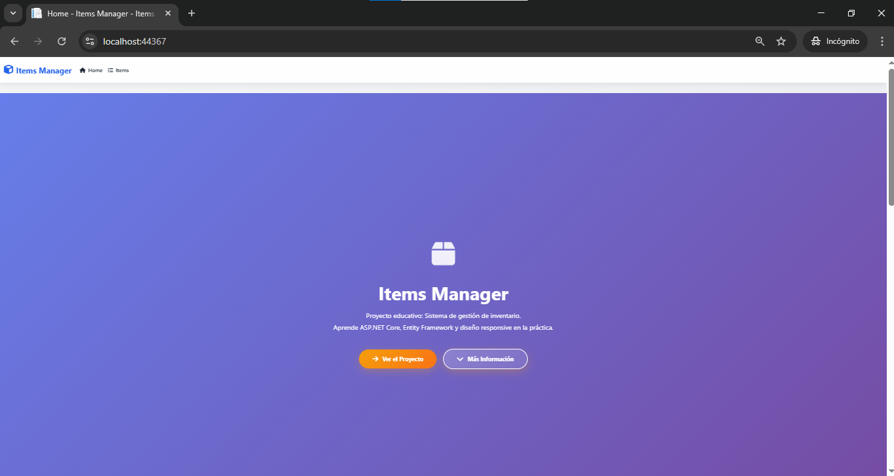

#### Segunda parte de la vista index
Segunda parte de la vista index donde se puede observar los conceptos implementados en este proyecto

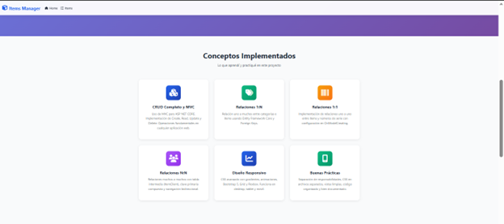

#### Tercera parte de la vista index
Tercera parte de la vista index donde se aprecia las tecnologias y tecnicas usadas en este proyecto

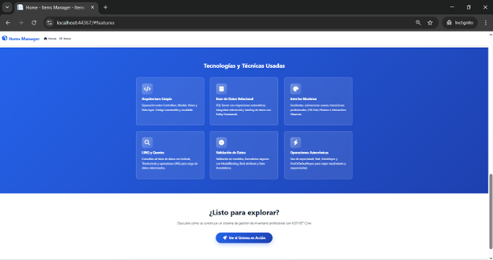

---

### Vista de Items

#### Vista general de todos los items en la base de datos en tiempo real
En esta vista se aprecian todos los items disponibles, se pueden editar, eliminar y crear.

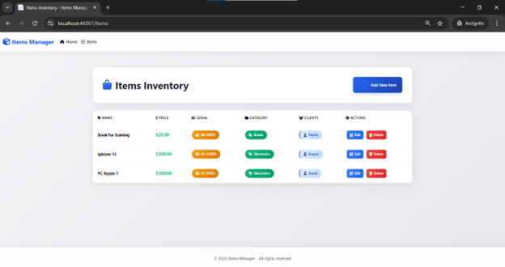

#### Vista de Editar Item
Vista para editar el item, se puede editar el nombre,precio,categoria,serial number y cliente desde el formulario.

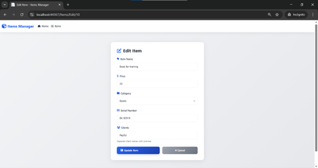

#### Vista de Eliminar Item
Vista para eliminar el item con previsualizacion del item que se va a eliminar.

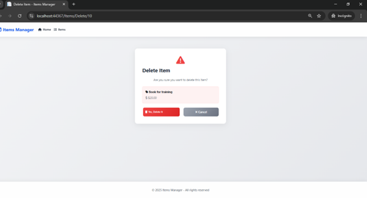

---

### Crear Nuevo Chiste

Formulario intuitivo para crear un item dandole nombre,precio,categoria,serial number y cliente.

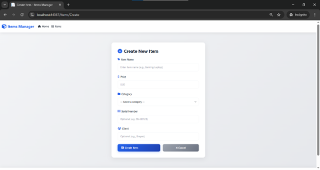

---


## Autor

- GitHub: [@Brayanj732](https://github.com/Brayanj732)
- LinkedIn: [Brayan Jimenez](https://www.linkedin.com/in/brayanjimenezdev)
- Email: brayanjimenezdev@outlook.com


---

## Licencia

Este proyecto está bajo la Licencia MIT - ver el archivo [LICENSE](LICENSE) para más detalles.

